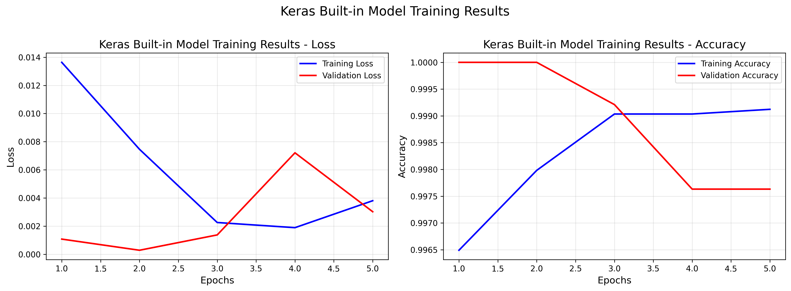
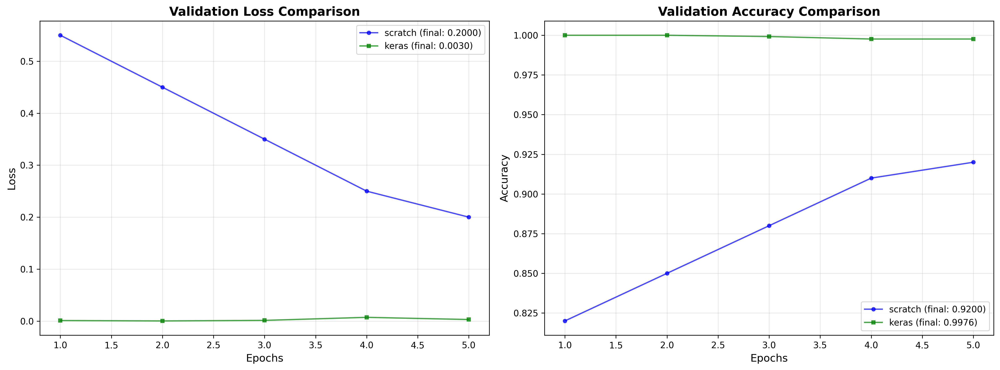

# MNIST Binary Classification — Neural Network From Scratch vs Keras (Grid Search + PSO)

Binary image classification on **MNIST digits 0 vs 1** using:
- A **fully-connected neural network built from scratch** with NumPy (manual forward/backprop).
- A **TensorFlow/Keras baseline** with the same architecture.
- **Hyperparameter optimization** using **Grid Search** and **Particle Swarm Optimization (PSO)**.

> Course: *Theoretical Foundation of Machine Learning* (Cairo University, 2025 – First Semester).  
> Instructor: Abdelrahman Sayed.  
> Report included in this repo.

---

## Project Overview

The pipeline follows:
1. Load MNIST and filter classes **{0,1}** (binary setting).
2. Normalize pixel values to **[0, 1]**.
3. Flatten images to a 1D feature vector.
4. Train:
   - NumPy neural network (from scratch)
   - Keras model (baseline)
5. Optimize hyperparameters:
   - Grid Search
   - PSO
6. Compare results + generate plots.

---

## Results (from report)

- **From-scratch model**
  - Train Accuracy: **0.9993**
  - Validation Accuracy: **0.9992**
  - Test Accuracy: **0.9991**

- **Keras model**
  - Train Accuracy: **0.9988**
  - Validation Accuracy: **0.9976**
  - Test Accuracy: **0.9991**

- **Optimization**
  - PSO reached **1.0000 validation accuracy** (best discovered configuration)

---

## Visualizations

### Keras training curves (loss & accuracy)


### Validation comparison (from-scratch vs Keras)


> If your filenames differ, update the paths above.

---

## Repository Structure

.
├─ src/
│ └─ nn_from_scratch_vs_keras.py
├─ assets/
│ ├─ keras_training_results.png
│ └─ models_comparison.png
├─ report/
│ └─ ML_Course_ProjectReport.pdf
├─ requirements.txt
└─ README.md


---

## Setup

### 1) Create and activate a virtual environment
**Windows (PowerShell):**
```bash
python -m venv .venv
.venv\Scripts\Activate
macOS/Linux:
python -m venv .venv
source .venv/bin/activate
```
 
2) Install dependencies
pip install -r requirements.txt
Run
From the project root:

python src/nn_from_scratch_vs_keras.py
The script:

Runs grid search over predefined configurations,

Prompts you to enter a custom network configuration,

Trains a from-scratch NN and a Keras NN,

Runs PSO optimization,

Generates plots (saved as PNG files).

Notes
This repo intentionally does not include any virtual environment folders (e.g., tf_env/, .venv/).

The task is simple (0 vs 1), so both models converge quickly and achieve near-perfect accuracy.

Authors
Omnia Ali Mohamed

Amina Mohy Eldeen

Basma Maher

Kenzy Hamdy

Shahd Abdelalim

License
This project is for educational use. If you reuse parts, please provide attribution.
